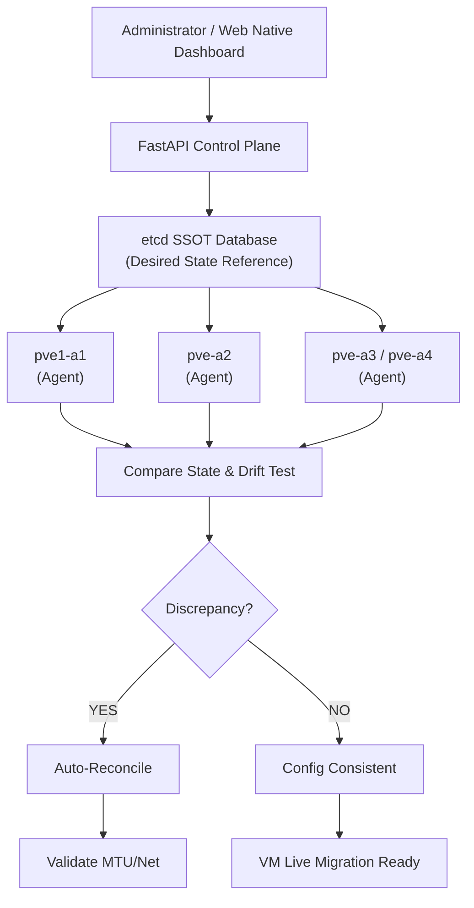

# proxmox-orchestrator

**Automated Orchestration Engine & State Synchronization Daemon** untuk kluster Proxmox VE (*nested virtualization*). Sistem ini mengimplementasikan pendekatan **Desired State Configuration (DSC)** berbasis `etcd` sebagai *Single Source of Truth* (SSOT) untuk mendeteksi *configuration drift*, melakukan *auto-healing/reconciliation* otomatis, dan memfasilitasi *control plane* via Web Native API.

---

## 📐 Arsitektur Sistem & Workflow

Sistem bekerja dengan membandingkan keadaan riil (*Actual State*) setiap node Proxmox terhadap keadaan yang diinginkan (*Desired State*) yang tersimpan di `etcd`:

