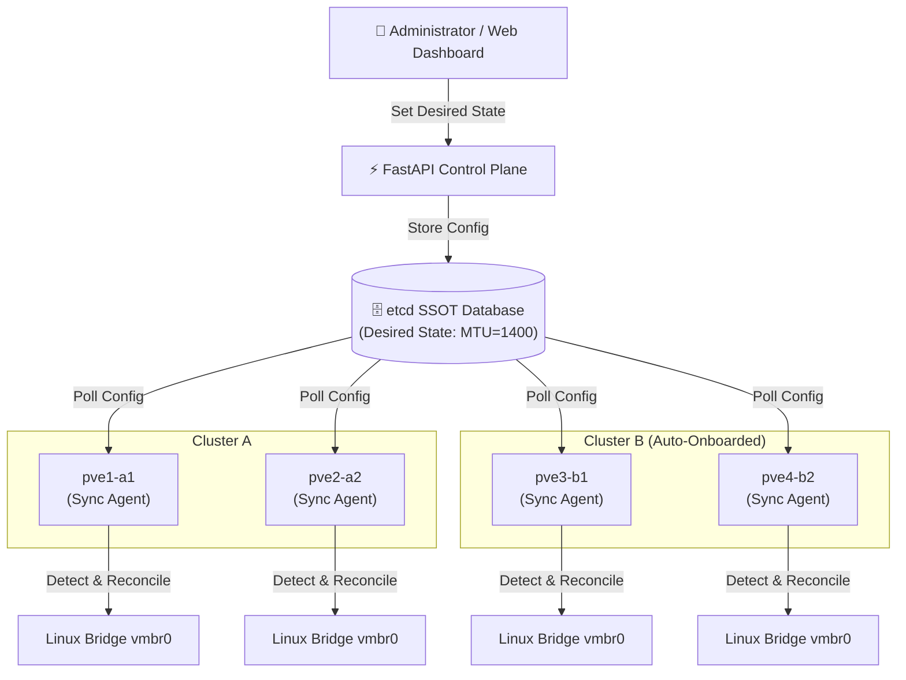

# 🚀 Proxmox Cluster Orchestrator & Auto-Healing Network Sync

[](https://opensource.org/licenses/MIT)
[](https://www.python.org/downloads/)
[](https://fastapi.tiangolo.com/)
[](https://etcd.io/)

**Proxmox Cluster Orchestrator** adalah *open-source control plane* dan *auto-healing engine* ringan untuk mengotomatisasi konfigurasi jaringan (seperti MTU `vmbrX`) antar-node dan antar-kluster pada lingkungan virtualisasi Proxmox VE.

Tools ini memecahkan masalah **Network Configuration Drift**—kondisi di mana perbedaan pengaturan jaringan pada satu node menyebabkan gagalnya *VM Live Migration* atau terputusnya konektivitas jaringan.

---

## 💡 Mengapa Tools Ini Dibuat?

Dalam mengelola kluster Proxmox:
1. **Pengaturan Manual Terlalu Rumit:** Mengubah MTU atau konfigurasi bridge di banyak node satu per satu memakan waktu dan rentan *human error*.
2. **Configuration Drift:** Seseorang bisa saja mengubah MTU di satu node secara tidak sengaja.
3. **Gagal Migrasi VM:** Jika VM dipindahkan (*Live Migration*) ke node yang MTU-nya berbeda, paket data berukuran besar (*Jumbo Frames*) akan terpecah (*fragmentation*) atau terbuang (*packet loss*).

Tools ini menerapkan konsep **Declarative State & Auto-Reconciliation** (seperti Kubernetes) menggunakan `etcd` sebagai acuan tunggal (*Single Source of Truth / SSOT*).

---

## 🏗️ Arsitektur Sistem



---

## ✨ Fitur Utama

* **🗄️ Distributed Configuration System (SSOT):** Menggunakan `etcd` v3 sebagai pusat acuan konfigurasi terpusat.
* **🔄 Auto-Healing Reconciliation:** Daemon `sync_agent.py` secara otomatis mendeteksi perubahan ilegal (*drift*) di interface fisik dan mengembalikannya ke kondisi acuan dalam hitungan detik.
* **🤖 Automated Node Onboarding:** Skrip otomatisasi untuk mendaftarkan node baru (`pve3`, `pve4`) ke dalam kluster baru sekaligus menginstal Sync Agent.
* **📊 Web Native Dashboard:** Antarmuka pemantauan status node (*In Sync / Drift*) secara real-time.
* **🧪 Integrated ICMP MTU Validation:** Tool bawaan web untuk menguji batas transmisi paket (*Don't Fragment*) antar-node.
* **🚚 Cross-Cluster Migration Validation:** Memastikan konektivitas VM tetap 100% stabil sebelum dan setelah proses *Live Migration*.

---

## 🚀 Panduan Instalasi (Quick Start)

### Prasyarat
1. Server/VM yang menjalankan **Proxmox VE 7.x / 8.x**.
2. **Python 3.10+** terinstal di Orchestrator dan Node.
3. Service **etcd** berjalan (Default IP: `10.10.10.58:2379`).

---

### Langkah 1: Clone Repositori
```bash
git clone [https://github.com/ahmadsyafik/proxmox-orchestrator.git](https://github.com/ahmadsyafik/proxmox-orchestrator.git)
cd proxmox-orchestrator
```

### Langkah 2: Setup Environment & Dependencies
```bash
python3 -m venv venv
source venv/bin/activate
pip install -r requirements.txt
```

### Langkah 3: Setup Passwordless SSH ke Seluruh Node
Agar Control Plane dapat membaca status fisik node tanpa meminta password:
```bash
ssh-keygen -t rsa -N "" -f ~/.ssh/id_rsa
ssh-copy-id root@<IP_NODE_PROXMOX>
```

### Langkah 4: Jalankan Control Plane Dashboard
```bash
uvicorn main_api:app --host 0.0.0.0 --port 8000 --reload
```
Akses dashboard di browser melalui `http://localhost:8000`.

---

### Langkah 5: Pasang Sync Agent di Node Proxmox

Di setiap node Proxmox (`pve1`, `pve2`, `pve3`, `pve4`), salin file `sync_agent.py` dan `config_ssot.py`, lalu buat service systemd:

1. Buat file `/etc/systemd/system/proxmox-sync.service`:
```ini
[Unit]
Description=Proxmox Network Auto-Healing Sync Agent
After=network.target

[Service]
Type=simple
User=root
WorkingDirectory=/root/proxmox-orchestrator
ExecStart=/usr/bin/python3 /root/proxmox-orchestrator/sync_agent.py
Restart=always
RestartSec=3

[Install]
WantedBy=multi-user.target
```

2. Aktifkan service:
```bash
systemctl daemon-reload
systemctl enable --now proxmox-sync
```

---

## 🧪 Cara Pengujian Sistem

### 1. Uji Auto-Healing (Drift Reconciliation)
1. Ubah MTU secara manual di salah satu node Proxmox:
   ```bash
   ip link set dev vmbr0 mtu 1300
   ```
2. Cek status interface beberapa detik kemudian:
   ```bash
   ip a show vmbr0
   ```
3. **Hasil:** MTU otomatis kembali ke nilai SSOT (misal `1400` atau `1500`) karena perbaikan otomatis oleh Sync Agent.

---

### 2. Uji Onboarding Kluster Baru (Cluster B)
Jalankan skrip pembentukan Cluster B dan penambahan node otomatis:
```bash
python3 scripts/auto_onboard_cluster.py --cluster-name Cluster-B --nodes 10.10.10.213,10.10.10.214
```

---

### 3. Uji Migrasi VM & Validasi Jaringan
1. Jalankan pengujian ping berkelanjutan dari dalam VM yang ada di Cluster A:
   ```bash
   ping 10.10.10.1
   ```
2. Lakukan *Live Migration* VM tersebut dari Cluster A (`pve1`) ke Cluster B (`pve3`).
3. Jalankan pengujian ICMP MTU Test di Dashboard Web untuk memastikan tidak ada paket yang ter-fragmentasi.

---

## 📝 Lisensi

Proyek ini dilisensikan di bawah [MIT License](LICENSE). Bebas digunakan, dimodifikasi, dan dikembangkan kembali.
